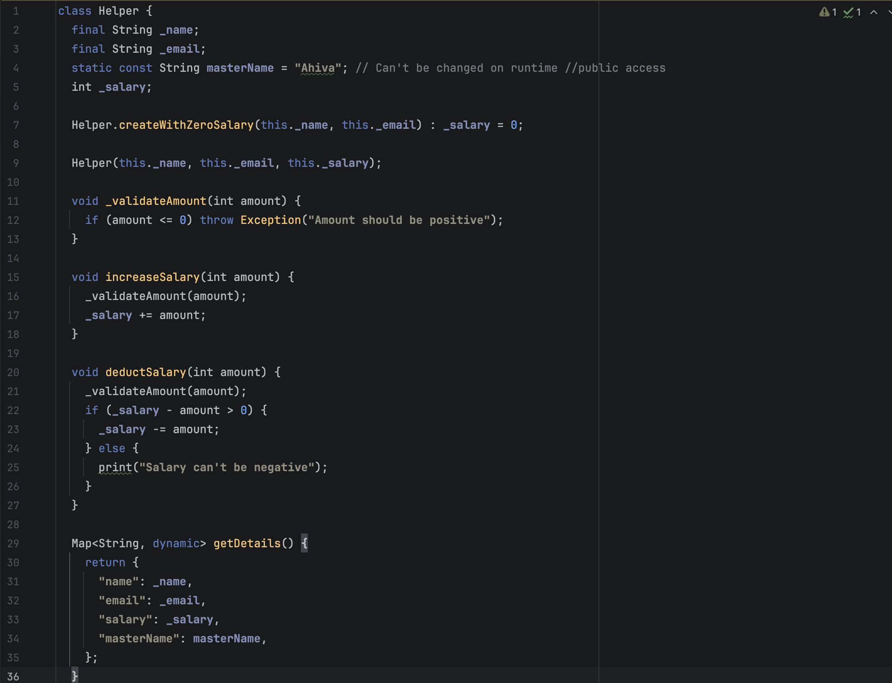
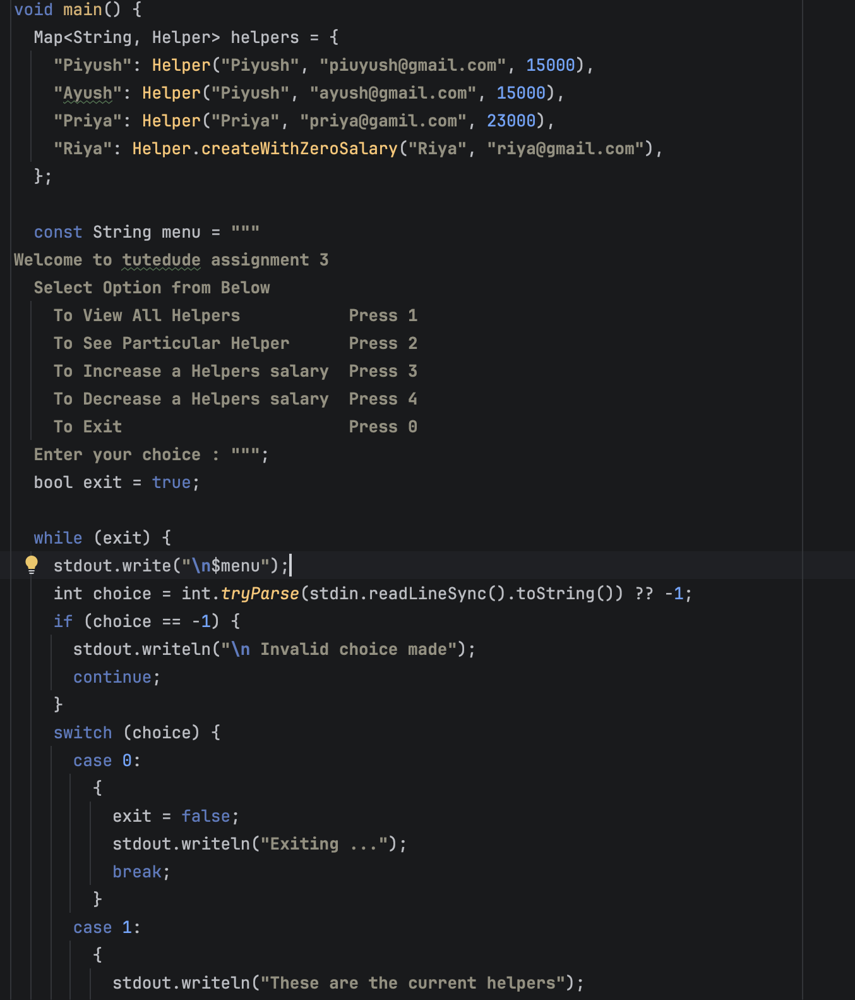
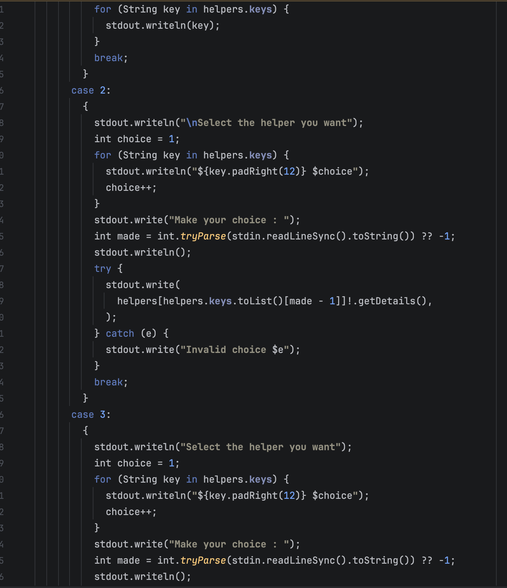
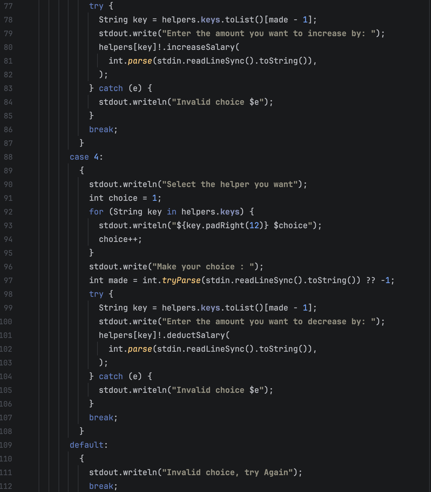
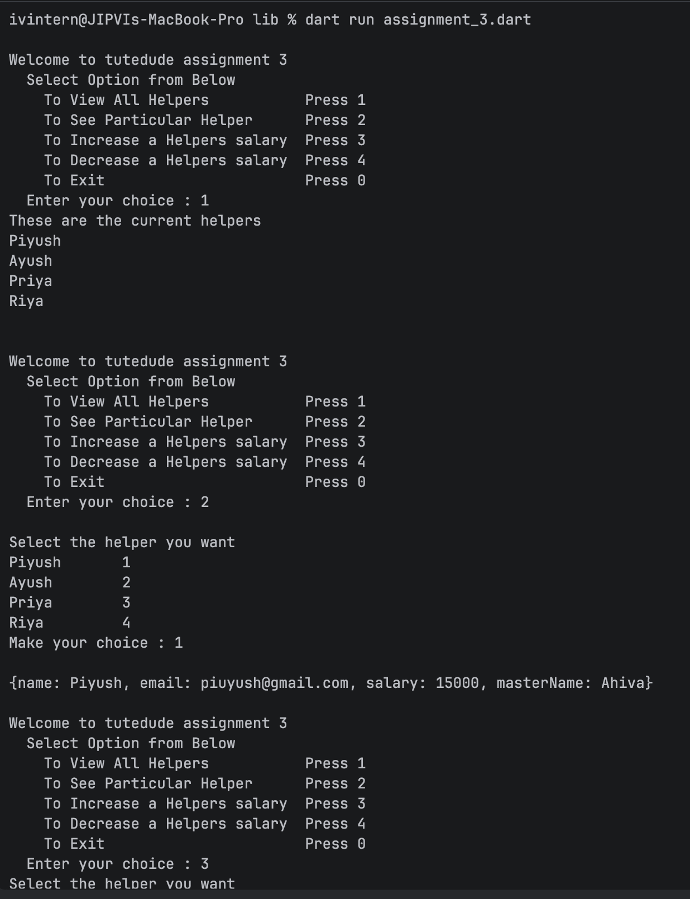
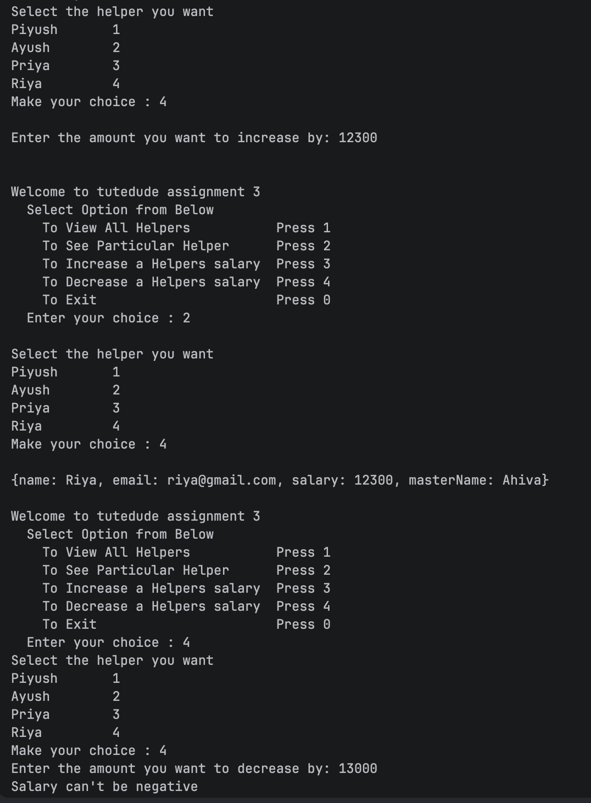
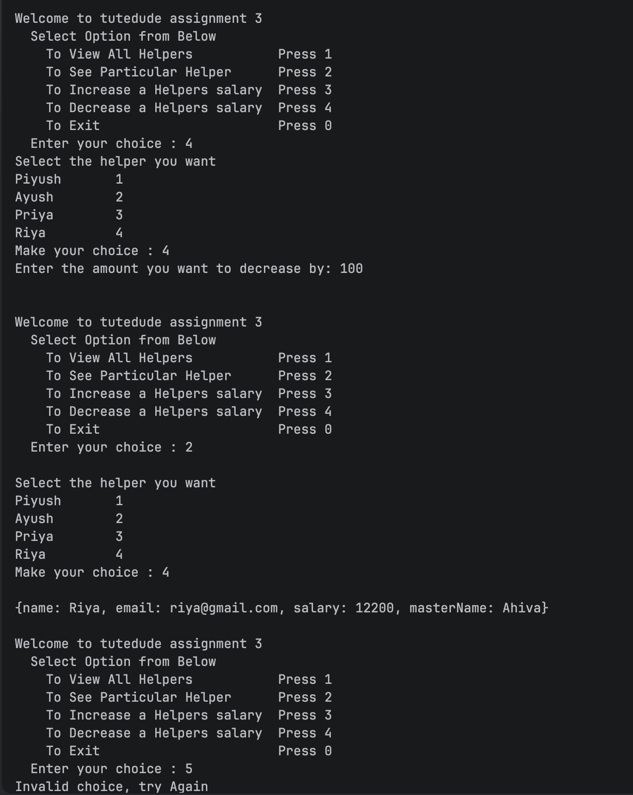

#  Assignment One

Helper class Image :

MainCode Images:

Output Images: 

For Other Assignment check other branches (current Assignments)

# Assignment One
# Assignment Two
# Assignment Three
# Assignment Four
# Assignment Five

